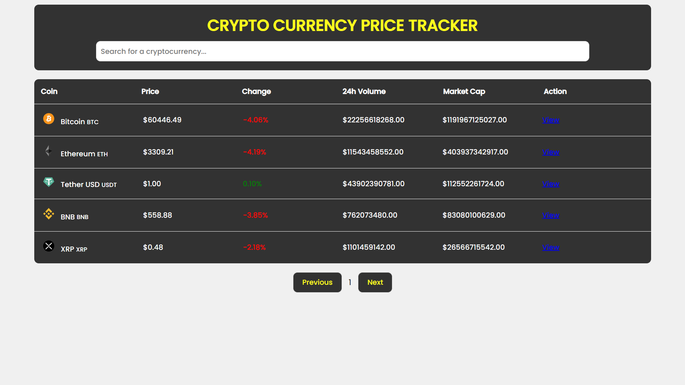

# Cryptocurrency Price Tracker

This project is a Cryptocurrency Price Tracker that fetches and displays real-time data for various cryptocurrencies. It allows users to search for specific cryptocurrencies, view paginated lists of coins, and see real-time price updates.

## Features

- **Real-Time Data:** Fetches and displays real-time price data for various cryptocurrencies.
- **Search Functionality:** Allows users to search for specific cryptocurrencies by name.
- **Pagination:** Displays a paginated list of cryptocurrencies, with controls to navigate between pages.
- **Real-Time Price Updates:** Updates the price data every 30 seconds.
- **Conditional Styling:** Displays positive price changes in green and negative price changes in red.
- **Error Handling:** Handles errors such as resource not found (404) and rate limit exceeded (429) gracefully.

## Technologies Used

- HTML
- CSS
- JavaScript
- CoinRanking API
## Project Structure

```
Crypto-Tracker/
     ├── index.html
     ├── style.css
     └── script.js
```
## Preview



## Live Preview
You can view the live preview of the Cryptocurrency Price Tracker project [here](https://daily-crypto-tracker.netlify.app).


